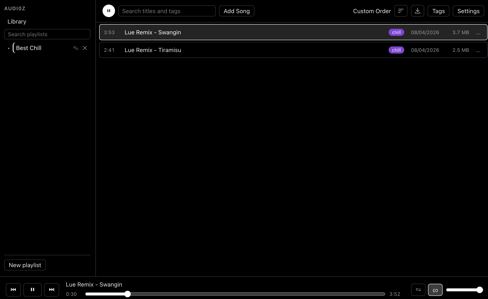

# Audi0z



A lightweight, local desktop library to store, organize, and play audio files. Built with Electron, React, and TypeScript. Supports `.wav, .opus, .mp3, .m4a, .aac, .flac, .ogg, .webm` files. Everything is local to your device. Details below:

## Features

- **Playback Engine** — play/pause, replay, backtrack, next, seek, volume change, shuffle and repeat. Supports AirPod taps and keyboard shortcuts: `space` = pause/play, `M` = mute/unmute, `←`/`→` = skip back/forward 10 seconds.
- **Local Storage** — audio files are stored in the respective `~/Music/audi0z` folder of the respective OS. Custom path can be set via ENV variable `AUDI0Z_LIBRARY_DIR`. No other files/folders touched.
- **Local Files** — import local file(s) to the library to read and play. Files are hard-copied.
- **URL Downloads** — paste a link (YouTube and everything else [yt-dlp](https://github.com/yt-dlp/yt-dlp) supports). The app probes the title, downloads the audio, and imports it with a live progress bar. One download at a time, cancelable mid-flight.
- **Opus Compression** — optionally transcodes files to Opus 96k via ffmpeg, and any imported file can be compressed later from `Settings`.
- **Tags** — tag audio files with a colour and title. Searchable.
- **Playlists** — create, rename, and delete playlists. Reorder playlists via **drag-and-drop**. Add files to playlists with search + tap. Shuffle and Repeat options set **per playlist**.
- **Search** — filters the visible list without touching the play queue: clicking a filtered row plays it within the full queue order
- **Safe deletes** — removing a song moves the file to the system Trash (recoverable).

## Installing

Prebuilt binaries are available under `releases` of this GitHub repo.

Variables:
- [Node.js](https://nodejs.org) **v22.23.2** (the pinned version in `.nvmrc` — with [nvm](https://github.com/nvm-sh/nvm): `nvm install`)
- `npm ci` run once in the repo (this also downloads Electron and the ffmpeg binary via postinstall)
- The packaging scripts automatically fetch the pinned [yt-dlp](https://github.com/yt-dlp/yt-dlp) binary (version 2026.08.19, SHA-256 verified) for your platform before building.

**NOTE1**: `Windows` and `Linux` are not tested (see more details below).

**NOTE2**: Errors involving URL downloads (via yt-dlp) are likely due to outdated version. Please notify me or manually resolve by updating variable `YTDLP_VERSION` in `/scripts/fetch-yt-dlp.mjs` and rebuild.


### macOS (Apple Silicon)

```bash
npm ci
npm run dist:mac
```

The installer lands at `dist/Audi0z-<version>-arm64.dmg` — with shortcut placed on your **Desktop**. Open it and drag the app to Applications.

**First launch:** the app is ad-hoc signed, not notarized, so Gatekeeper will refuse a normal double-click on a downloaded copy ("cannot be opened because the developer cannot be verified"). **Right-click the app → Open → Open** the first time; after that it opens normally.

### Windows

```bash
npm ci
npm run dist:win
```

Produces an NSIS installer under `dist/` (with a copy on your Desktop). Run it and follow the prompts. SmartScreen may warn about an unrecognized app — choose "More info → Run anyway" (the installer is unsigned).

> The Windows target is configured but has not been exercised by this project's release verification (which ran on macOS). Please report issues.

### Linux

```bash
npm ci
npm run dist:linux
```

Produces an AppImage under `dist/` (with a copy on your Desktop). Make it executable and run it:

```bash
chmod +x dist/Audi0z-*.AppImage
./dist/Audi0z-*.AppImage
```

> Like Windows, the Linux target is configured but untested by the release verification.

### Running from source (development)

```bash
nvm use            # or otherwise select Node v22.23.2
npm ci
npm run fetch:ytdlp   # yt-dlp binaries for URL downloads (skippable if you never download)
npm run dev           # launches the app with hot reload
```

## Where your music lives

Everything is stored in one folder:

| Platform | Default location  |
| -------- | ----------------- |
| all      | `~/Music/audi0z/` |

The folder deliberately keeps the app's original name: libraries created before the rename to Audi0z keep working untouched, and nothing about your data moves.

Inside it: `audio/` (the actual files, named by internal id), `library.json` (song metadata), `playlists.json`, `tags.json` (the tag registry), and `settings.json`. All four JSON files are written atomically (temp file → fsync → rename), so a crash mid-write can't corrupt them; a corrupted file found at startup is quarantined to `.bak` and the app continues with defaults.

To use a different folder (or keep multiple libraries), set the `AUDI0Z_LIBRARY_DIR` environment variable before launching.

## Development reference

| Command                                        | What it does                                                       |
| ---------------------------------------------- | ------------------------------------------------------------------ |
| `npm run dev`                                  | run the app with hot reload                                        |
| `npm test`                                     | full unit/component suite (vitest, node + jsdom projects)          |
| `npm run e2e`                                  | build, then Playwright end-to-end suite driving the real built app |
| `npm run typecheck` / `lint` / `format`        | the usual hygiene                                                  |
| `npm run package`                              | unpacked build in `dist/` (no installer)                           |
| `npm run dist:mac` / `dist:win` / `dist:linux` | platform installers (a copy lands on your Desktop)                 |
| `npm run fetch:ytdlp`                          | (re)download the pinned yt-dlp binaries into `resources/bin/`      |

## Third-party software

The packaged app bundles a **GPL build of ffmpeg** (via `ffmpeg-static`) and downloads the **yt-dlp** binary (Unlicense). See `NOTICE.md` for the licensing details and obligations.

## License

MIT.
